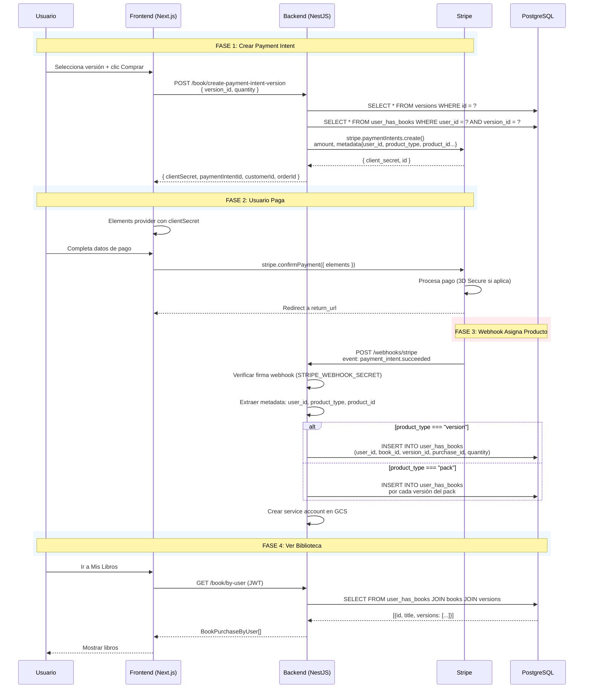

# Guía de Integración: Payment Element para Libros (Next.js / TypeScript)

**Versión:** 3.0  
**Última actualización:** 5/5/2026  
**Estado:** ✅ VIGENTE — Este es el documento oficial

---

## 📋 Resumen

El sistema de pagos de libros usa **Stripe Payment Element** para compras físicas y **Stripe Subscriptions** para suscripciones digitales. Ambos se integran desde el frontend con `@stripe/stripe-js` y `@stripe/react-stripe-js`.

**Tipos de producto:**

| Tipo | Endpoint | Stripe Object | Precio desde |
|------|----------|---------------|--------------|
| Versión física | `create-payment-intent-version` | PaymentIntent | `versions.price` (BD) |
| Pack físico | `create-payment-intent-pack` | PaymentIntent | `packs.price` (BD) |
| Suscripción digital | `create-payment-intent-digital` | Subscription | Stripe Price ID (env) |
| Libro genérico (legacy) | `create-payment-intent` | PaymentIntent o Subscription | Según `format` |

---

## 🔗 Endpoints

### 1. `POST /api/v1/book/create-payment-intent-version`

**Uso recomendado para compras físicas de una versión específica.**

#### Request Body

```typescript
interface CreateVersionOrderRequest {
  version_id: string;  // UUID de la versión (requerido)
  quantity?: number;   // 1-100 (default: 1)
}
```

#### Flujo interno (book.service.ts:46-83)

```
1. getVersionWithBook(version_id) → obtiene versión + libro padre
2. Valida: book.is_active !== false
3. Valida: usuario no tiene esta versión (checkIfUserHasVersion)
4. Precio: parseFloat(version.price) → debe ser > 0
5. Monto: Math.round(versionPrice * quantity * 100) → centavos
6. Crea PaymentIntent con metadata:
   - user_id, product_type: "version", product_id: version_id
   - quantity, format: "physical"
   - version_id, book_id (en metadata adicional)
```

#### Response (201)

```typescript
interface PaymentIntentResponse {
  clientSecret: string;      // "pi_xxx_secret_xxx" → para Elements
  paymentIntentId: string;   // "pi_xxx"
  customerId: string;        // "cus_xxx" o ""
  orderId: string;           // "ORD-{timestamp}-{userId8}-{random4}"
}
```

#### Errores (400)

| Mensaje | Causa |
|---------|-------|
| `Version not found` | version_id no existe |
| `Book is not available for purchase` | Libro desactivado (soft delete) |
| `User already has this version` | Ya comprada |
| `Invalid version price. Price must be greater than 0` | Precio 0 o inválido en BD |

---

### 2. `POST /api/v1/book/create-payment-intent-pack`

**Para comprar un pack que incluye varias versiones.**

#### Request Body

```typescript
interface CreatePackOrderRequest {
  pack_id: string;    // UUID del pack (requerido)
  quantity?: number;  // 1-100 (default: 1)
}
```

#### Flujo interno (book.service.ts:88-134)

```
1. getPackById(pack_id) → obtiene pack
2. getPackItemsWithVersion(pack_id) → obtiene items con version_id y book_id
3. Valida: pack tiene items
4. Valida: usuario no tiene NINGUNA versión del pack
5. Precio: parseFloat(pack.price) → debe ser > 0
6. Monto: Math.round(packPrice * quantity * 100) → centavos
7. Crea PaymentIntent con metadata:
   - product_type: "pack", product_id: pack_id
   - quantity, format: "physical", pack_id
```

#### Response (201)

Misma estructura que `PaymentIntentResponse`.

#### Errores (400)

| Mensaje | Causa |
|---------|-------|
| `Pack not found` | pack_id no existe |
| `Pack has no items` | Pack sin versiones asociadas |
| `User already has a version from this pack (version {id})` | Ya tiene una versión del pack |
| `Invalid pack price. Price must be greater than 0` | Precio 0 o inválido |

---

### 3. `POST /api/v1/book/create-payment-intent-digital`

**Para suscripciones a la biblioteca digital (monthly/annual/permanent).**

> ⚠️ Este endpoint crea una **Stripe Subscription**, no un PaymentIntent directo. El precio viene de Stripe Price IDs configurados en variables de entorno, **NO** de la base de datos.

#### Request Body

```typescript
interface CreateDigitalSubscriptionRequest {
  subscription_type: 'monthly' | 'annual' | 'permanent';  // Requerido
}
```

#### Flujo interno (book.service.ts:141-188)

```
1. checkActiveDigitalLibrarySubscription(user_id)
2. Si tiene suscripción activa → retorna hasActiveSubscription: true (sin cobro)
3. Si NO tiene suscripción activa:
   a. Requiere subscription_type
   b. Mapea subscription_type → Stripe Price ID:
      - monthly  → STRIPE_PRICE_ID_DIGITAL_LIBRARY_MONTHLY  (price_1TGkwq...)
      - annual   → STRIPE_PRICE_ID_DIGITAL_LIBRARY_ANNUAL   (price_1TGkyp...)
      - permanent→ STRIPE_PRICE_ID_DIGITAL_LIBRARY_PERMANENT(price_1TGkzs...)
   c. Crea Stripe Subscription con:
      - payment_method_types: ['card', 'sepa_debit', 'paypal']
      - payment_behavior: 'default_incomplete'
      - metadata: { user_id, subscription_type, product_type: 'digital_library' }
```

#### Response (201)

```typescript
// Caso A: Usuario YA tiene suscripción activa
{
  clientSecret: '',           // Vacío — no necesita pagar
  paymentIntentId: '',
  customerId: '',
  orderId: 'subscription-id',
  hasActiveSubscription: true  // ← CLAVE: el frontend debe detectar esto
}

// Caso B: Se crea nueva suscripción
{
  clientSecret: 'pi_xxx_secret_xxx',  // Del PaymentIntent dentro de la Subscription
  paymentIntentId: 'sub_xxx',         // ID de la Subscription (no PI)
  customerId: 'cus_xxx',
  orderId: 'sub_xxx',
  hasActiveSubscription: false
}
```

#### Errores (400/500)

| Mensaje | Causa |
|---------|-------|
| `Subscription type is required...` | Falta subscription_type y no tiene suscripción activa |
| `User email is required...` | JWT no tiene email |
| `Price ID not configured for subscription type: {type}` (500) | Falta variable de entorno |

---

### 4. `POST /api/v1/book/create-payment-intent` (Legacy)

**Endpoint genérico que delega según `format`.**

#### Request Body

```typescript
interface CreateBookOrderRequest {
  book_id: string;                                          // UUID del libro (requerido)
  format: 'physical' | 'digital';                           // Requerido
  quantity?: number;                                        // Para physical (1-100)
  subscription_type?: 'monthly' | 'annual' | 'permanent';  // Para digital sin suscripción
}
```

#### Flujo interno (book.service.ts:194-232)

```
Si format === 'digital':
  → Delega a createPaymentIntentForDigital(subscription_type)
  → Usa Stripe Price IDs (NO book.price)

Si format === 'physical':
  1. getBookById(book_id) → valida existencia
  2. getBooks() → busca primera versión del libro
  3. Toma versions[0].version_id
  4. → Delega a createPaymentIntentForVersion(version_id, quantity)
  5. Precio: versions[0].price (de la tabla versions, NO de books)
```

> ⚠️ **IMPORTANTE:** La tabla `books` NO tiene campo `price`. El precio siempre viene de `versions.price`. Si el frontend anterior asumía `book.price`, eso era incorrecto.

---

### 5. `GET /api/v1/book/by-user`

**Obtiene los libros comprados por el usuario autenticado.**

#### Request

Solo requiere JWT en el header `Authorization: Bearer <token>`.

#### Response (200)

```typescript
interface BookPurchaseByUser {
  id: string;        // ID del libro
  title: string;
  subtitle: string;
  image: string;     // URL de imagen
  versions: {
    version_id: string;
    version_title: string;
    version_image: string;
  }[];
}

// Response: BookPurchaseByUser[] — puede ser [] si no tiene libros
```

> ✅ Siempre retorna 200, incluso si el array está vacío.

---

### 6. `GET /api/v1/book/all`

**Catálogo de libros disponibles (con precios por versión).**

#### Response (200)

```typescript
interface BookCatalog {
  id: string;
  title: string;
  subtitle: string;
  image: string;
  versions: {
    version_id: string;
    version_title: string;
    version_image: string;
    version_price: string;  // ← Precio de cada versión
  }[];
}
```

---

## 🔧 Integración Frontend (Next.js + TypeScript)

### Dependencias

```bash
npm install @stripe/stripe-js @stripe/react-stripe-js
```

### Ejemplo: Compra de Versión Física

```typescript
// lib/stripe.ts
import { loadStripe } from '@stripe/stripe-js';

export const stripePromise = loadStripe(process.env.NEXT_PUBLIC_STRIPE_PUBLISHABLE_KEY!);

// Paso 1: Crear Payment Intent
async function createPaymentIntent(versionId: string, quantity: number = 1) {
  const res = await fetch('/api/v1/book/create-payment-intent-version', {
    method: 'POST',
    headers: {
      'Content-Type': 'application/json',
      'Authorization': `Bearer ${getJwtToken()}`,
    },
    body: JSON.stringify({ version_id: versionId, quantity }),
  });

  if (!res.ok) {
    const error = await res.json();
    throw new Error(error.message);
  }

  return res.json() as Promise<{
    clientSecret: string;
    paymentIntentId: string;
    customerId: string;
    orderId: string;
  }>;
}
```

```tsx
// components/PaymentForm.tsx
'use client';
import { Elements, PaymentElement, useStripe, useElements } from '@stripe/react-stripe-js';
import { stripePromise } from '@/lib/stripe';

function CheckoutForm() {
  const stripe = useStripe();
  const elements = useElements();

  const handleSubmit = async (e: React.FormEvent) => {
    e.preventDefault();
    if (!stripe || !elements) return;

    const { error } = await stripe.confirmPayment({
      elements,
      confirmParams: {
        return_url: `${window.location.origin}/payment-success`,
      },
    });

    if (error) {
      console.error('Payment error:', error.message);
    }
  };

  return (
    <form onSubmit={handleSubmit}>
      <PaymentElement />
      <button type="submit" disabled={!stripe}>Pagar</button>
    </form>
  );
}

// Wrapper con Elements provider
export function PaymentWrapper({ clientSecret }: { clientSecret: string }) {
  return (
    <Elements stripe={stripePromise} options={{ clientSecret }}>
      <CheckoutForm />
    </Elements>
  );
}
```

### Ejemplo: Suscripción Digital

```typescript
async function createDigitalSubscription(type: 'monthly' | 'annual' | 'permanent') {
  const res = await fetch('/api/v1/book/create-payment-intent-digital', {
    method: 'POST',
    headers: {
      'Content-Type': 'application/json',
      'Authorization': `Bearer ${getJwtToken()}`,
    },
    body: JSON.stringify({ subscription_type: type }),
  });

  const data = await res.json();

  // ⚠️ IMPORTANTE: Verificar si ya tiene suscripción activa
  if (data.hasActiveSubscription) {
    // No necesita pagar — redirigir a biblioteca
    router.push('/library');
    return;
  }

  // Si no tiene suscripción, mostrar Payment Element con el clientSecret
  setClientSecret(data.clientSecret);
}
```

---

## 🔄 Flujo Completo Post-Pago



---

## 📊 Metadata en el Payment Intent

Estos campos se incluyen automáticamente en el PaymentIntent y son leídos por el webhook para asignar el producto:

| Campo | Valor | Requerido |
|-------|-------|-----------|
| `user_id` | UUID del usuario | ✅ Sí |
| `user_email` | Email del JWT | ✅ Sí |
| `product_type` | `"version"`, `"pack"`, `"book"` | ✅ Sí |
| `product_id` | UUID del producto | ✅ Sí |
| `product_name` | Título descriptivo | ✅ Sí |
| `order_id` | `ORD-{ts}-{uid}-{rand}` | ✅ Auto |
| `order_date` | ISO 8601 | ✅ Auto |
| `quantity` | String numérico | Si aplica |
| `format` | `"physical"` o `"digital"` | Si aplica |
| `version_id` | UUID (para versiones) | Si aplica |
| `book_id` | UUID del libro padre | Si aplica |
| `pack_id` | UUID (para packs) | Si aplica |

> ⚠️ Si el webhook recibe un PaymentIntent **sin `user_id` en metadata**, lanza error 400 y **NO asigna el producto**. Esto previene compras fantasma.

---

## 🔐 Autenticación

Todos los endpoints de pago requieren JWT Bearer Token:

```
Authorization: Bearer <jwt_token>
```

Del JWT se extraen automáticamente:
- `req.user.id` → `user_id`
- `req.user.email` → `user_email` (para Stripe Customer y recibos)
- `req.user.firstName` + `req.user.lastName` → `userName`

---

## ❌ Errores Comunes

| Código | Mensaje | Solución Frontend |
|--------|---------|-------------------|
| 400 | `User already has this version` | No mostrar botón de compra si ya la tiene |
| 400 | `Version not found` | Verificar que el version_id sea correcto |
| 400 | `Invalid version price` | Error de datos en BD — reportar a backend |
| 400 | `Book has no versions` | El libro no tiene versiones creadas |
| 401 | Token inválido | Renovar JWT |
| 500 | `Error al crear Payment Intent` | Error de Stripe — revisar logs backend |

---

## 📁 Archivos de Referencia en el Backend

| Archivo | Rol |
|---------|-----|
| `src/squat-fit/book/controller/book.controller.ts` | Endpoints HTTP |
| `src/squat-fit/book/services/book.service.ts` | Lógica de negocio y validaciones |
| `src/squat-fit/book/dto/book.dto.ts` | DTOs con validación (class-validator) |
| `src/squat-fit/book/repository/book.repository.ts` | Queries a BD (Knex) |
| `src/core/stripe/stripe-payment-element.service.ts` | Creación de PaymentIntents y Subscriptions en Stripe |
| `src/core/webhooks/services/stripe-webhook.service.ts` | Procesamiento de webhooks |
| `env-vars.yaml` | Variables de entorno (Price IDs, Webhook Secret) |

---

## ✅ Checklist para Frontend

- [ ] Usar `create-payment-intent-version` para compras físicas de versión específica
- [ ] Usar `create-payment-intent-digital` para suscripciones digitales
- [ ] Detectar `hasActiveSubscription: true` para no mostrar formulario de pago
- [ ] Pasar `subscription_type` al endpoint digital (monthly/annual/permanent)
- [ ] Montar `<PaymentElement />` con el `clientSecret` recibido
- [ ] Usar `stripe.confirmPayment()` con `return_url` para confirmar
- [ ] Después del pago, esperar ~2s antes de consultar `GET /book/by-user`
- [ ] Manejar array vacío `[]` en `GET /book/by-user` como "sin libros" (NO como error)
- [ ] `GET /course/by-user` también retorna `[]` vacío (status 200), no 404
