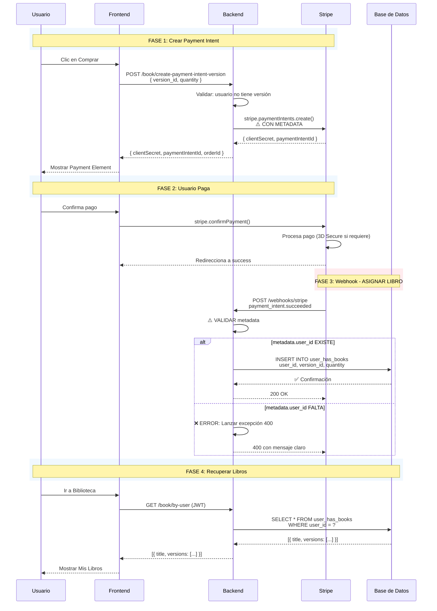

# Informe: Funcionamiento Interno del Endpoint de Payment Intent para Libros

## 📋 Resumen Ejecutivo

Este documento describe el funcionamiento interno del endpoint `POST /api/v1/book/create-payment-intent`, que crea un Payment Intent de Stripe para procesar pagos de libros con múltiples métodos de pago.

**✅ Migración Completada:** Todos los métodos de pago legacy (PayPal directo, Stripe Checkout Session) han sido eliminados y migrados a Stripe Payment Element. Este es ahora el único método de pago para compras web.

---

## 🔗 Endpoint

**Ruta:** `POST /api/v1/book/create-payment-intent`  
**Versión:** `v1`  
**Autenticación:** Requerida (Bearer Token)  
**Tags:** `Book - Payment Element`

---

## 📥 Entrada del Endpoint

### Request Body

```typescript
{
  book_id: string; // UUID del libro a comprar (requerido)
}
```

### Headers

```
Authorization: Bearer <jwt_token>
Content-Type: application/json
```

### Datos Obtenidos Automáticamente del Token JWT

El endpoint extrae automáticamente del token JWT:
- `user_id`: ID del usuario autenticado
- `user.email`: Email del usuario
- `user.firstName`: Nombre del usuario
- `user.lastName`: Apellido del usuario

---

## 📤 Respuesta del Endpoint

### Respuesta Exitosa (201 Created)

```typescript
{
  clientSecret: string;        // Secret para inicializar Stripe Payment Element
  paymentIntentId: string;     // ID del Payment Intent creado (formato: pi_xxx)
  customerId: string;          // ID del Stripe Customer (formato: cus_xxx o cadena vacía)
  orderId: string;             // ID único de la orden generado internamente (formato: ORD-timestamp-userId-random)
}
```

**Ejemplo de respuesta:**
```json
{
  "clientSecret": "pi_3ABC123def456GHI789_secret_xyz789",
  "paymentIntentId": "pi_3ABC123def456GHI789",
  "customerId": "cus_ABC123def456GHI",
  "orderId": "ORD-1738022400000-12345678-5678"
}
```

---

## 🔄 Flujo Interno del Endpoint

### 1. Controlador (`BookController.createPaymentIntent`)

**Ubicación:** `src/squat-fit/book/controller/book.controller.ts`

#### Pasos:

1. **Validación de Autenticación**
   - El middleware `ValidateTokenMiddleware` valida el token JWT
   - Extrae información del usuario: `id`, `email`, `firstName`, `lastName`

2. **Extracción de Datos**
   ```typescript
   // Del body
   book_id: body.book_id
   
   // Del token JWT
   user_id: req.user.id
   user_email: req.user.email
   user_name: `${req.user.firstName} ${req.user.lastName}`
   ```

3. **Llamada al Servicio**
   ```typescript
   BookService.createPaymentIntent(user_id, book_id, user_email, user_name)
   ```

---

### 2. Servicio de Negocio (`BookService.createPaymentIntent`)

**Ubicación:** `src/squat-fit/book/services/book.service.ts`

#### Pasos:

##### 2.1. Validación de Duplicados
```typescript
// Verifica si el usuario ya tiene el libro
const validUserHasBook = await BookRepository.checkIfUserHasBook(user_id, book_id);

if (validUserHasBook) {
  throw new HttpException('User already has this book', 400);
}
```

**Tabla consultada:** `user_has_books`  
**Query:** `SELECT * FROM user_has_books WHERE user_id = ? AND book_id = ?`

##### 2.2. Obtención del Libro
```typescript
// Obtiene el libro de la base de datos
const book = await BookRepository.getBookById(book_id);

if (!book) {
  throw new HttpException('Book not found', 400);
}
```

**Tabla consultada:** `books`  
**Query:** `SELECT * FROM books WHERE id = ?`

**Campos obtenidos:**
- `id`: UUID del libro
- `title`: Título del libro
- `subtitle`: Subtítulo del libro
- `price`: Precio en formato string (ej: "20.00")
- `image`: URL de la imagen de la carátula

##### 2.3. Validación del Precio
```typescript
// Valida que el precio sea válido
const bookPrice = parseFloat(book.price);

if (isNaN(bookPrice) || bookPrice <= 0) {
  throw new HttpException('Invalid book price. Price must be greater than 0', 400);
}
```

**Validaciones:**
- El precio debe ser un número válido
- El precio debe ser mayor que 0
- Se previene que libros con precio inválido o gratuito generen Payment Intents

##### 2.4. Conversión del Precio
```typescript
// Convierte el precio a centavos (Stripe requiere montos en la unidad menor)
const amountInCents = Math.round(bookPrice * 100);
```

**Ejemplo:**
- Precio del libro: `20.50` EUR
- Monto en centavos: `2050`

##### 2.5. Llamada al Servicio de Stripe
```typescript
return await stripePaymentElementService.createPaymentIntent({
  amount: amountInCents,                    // Monto en centavos
  currency: 'eur',                          // Moneda (EUR)
  userId: user_id,                          // ID del usuario
  productType: 'book',                      // Tipo de producto
  productId: book.id,                       // ID del libro
  productName: `${book.title} ${book.subtitle}`, // Nombre completo del libro
  userEmail: user_email,                    // Email del usuario
  userName: user_name,                      // Nombre completo del usuario
});
```

---

### 3. Servicio de Stripe (`StripePaymentElementService.createPaymentIntent`)

**Ubicación:** `src/core/stripe/stripe-payment-element.service.ts`

#### Pasos:

##### 3.1. Generación de Order ID
```typescript
// Genera un Order ID único si no se proporciona
const orderId = params.orderId || this.generateOrderId(params.userId);
```

**Método `generateOrderId`:**
```typescript
private generateOrderId(userId: string): string {
  const timestamp = Date.now();                                    // Timestamp actual
  const userShortId = userId.substring(0, 8).replace(/-/g, '').toUpperCase(); // Primeros 8 caracteres del UUID sin guiones
  const random = Math.floor(Math.random() * 10000).toString().padStart(4, '0'); // Número aleatorio de 4 dígitos
  return `ORD-${timestamp}-${userShortId}-${random}`;
}
```

**Formato:** `ORD-{timestamp}-{userIdShort}-{random}`  
**Ejemplo:** `ORD-1738022400000-12345678-5678`

**Características:**
- Único: Timestamp + ID de usuario + número aleatorio
- Rastreable: Incluye timestamp para ordenamiento cronológico
- Identificable: Incluye parte del ID del usuario para rastreo

##### 3.2. Creación/Obtención de Stripe Customer
```typescript
// Intenta crear o obtener un Customer de Stripe para el usuario
let customerId: string | undefined = undefined;

if (params.userEmail) {
  try {
    customerId = await this.createOrGetCustomer({
      userId: params.userId,
      email: params.userEmail,
      name: params.userName,
    });
  } catch (customerError) {
    // Si falla, continúa sin customer (no crítico)
    logger.warn('No se pudo obtener/crear customer');
  }
}
```

**Método `createOrGetCustomer`:**
1. **Buscar Customer Existente:**
   ```typescript
   const existingCustomers = await stripe.customers.list({
     email: params.email,
     limit: 1,
   });
   ```
   
   - Busca en Stripe un customer con el mismo email
   - Si existe, retorna su ID

2. **Crear Nuevo Customer (si no existe):**
   ```typescript
   const customer = await stripe.customers.create({
     email: params.email,
     name: params.name,
     metadata: {
       user_id: params.userId,
     },
   });
   ```
   
   - Crea un nuevo customer en Stripe
   - Guarda el `user_id` en metadata para vinculación
   - Retorna el ID del customer creado

**Beneficios de usar Customer:**
- Permite guardar métodos de pago para futuras compras
- Mejora la experiencia del usuario (no necesita reingresar datos)
- Facilita el seguimiento en Stripe Dashboard
- Permite generar facturas y recibos automáticos

##### 3.3. Construcción del Payment Intent
```typescript
const paymentIntentData: Stripe.PaymentIntentCreateParams = {
  amount: params.amount,                    // Monto en centavos
  currency: params.currency || 'eur',       // Moneda (default: EUR)
  
  // ✅ Métodos de pago automáticos
  automatic_payment_methods: {
    enabled: params.automaticPaymentMethods ?? true,
  },
  
  // ✅ Metadata completa para rastreo
  metadata: {
    user_id: params.userId,                 // ID del usuario en nuestra BD
    user_email: params.userEmail || '',     // Email del usuario
    product_type: params.productType,       // Tipo: 'book'
    product_id: params.productId,           // ID del libro
    product_name: params.productName,       // Nombre del libro
    order_id: orderId,                      // Order ID único generado
    order_date: new Date().toISOString(),   // Fecha/hora de la orden (ISO 8601)
  },
  
  // ✅ Descripción clara para el usuario y Stripe
  description: `Compra de ${params.productName}`,
  
  // ✅ Configuración de seguridad SCA (Strong Customer Authentication)
  payment_method_options: {
    card: {
      request_three_d_secure: 'automatic',  // Requiere 3D Secure en Europa
    },
  },
  
  // ✅ Email para recibo (si se proporciona)
  ...(params.userEmail && { receipt_email: params.userEmail }),
  
  // ✅ Customer ID (si se obtuvo/creó exitosamente)
  ...(customerId && { customer: customerId }),
};
```

**Explicación de Campos:**

1. **`amount` y `currency`:**
   - Monto en la unidad menor (centavos para EUR)
   - Moneda estándar (EUR para Europa)

2. **`automatic_payment_methods`:**
   - Activa todos los métodos configurados en Stripe Dashboard
   - Incluye: Cards, PayPal, Klarna, SEPA, Google Pay, Apple Pay
   - Se actualiza automáticamente cuando se agregan nuevos métodos en Stripe

3. **`metadata`:**
   - Información adicional almacenada en Stripe
   - Accesible en webhooks y dashboard
   - Útil para rastreo y reconciliación
   - **Campos incluidos:**
     - `user_id`: ID del usuario en nuestra base de datos
     - `user_email`: Email del usuario
     - `product_type`: Tipo de producto (`'book'`)
     - `product_id`: ID del libro
     - `product_name`: Nombre completo del libro
     - `order_id`: Order ID único generado
     - `order_date`: Fecha/hora de creación (ISO 8601)

4. **`description`:**
   - Descripción visible para el usuario
   - Aparece en recibos y facturas
   - Formato: `"Compra de {Título} {Subtítulo}"`

5. **`payment_method_options.card.request_three_d_secure`:**
   - Requiere autenticación 3D Secure para tarjetas
   - Obligatorio en Europa (PSD2)
   - Mejora la seguridad del pago

6. **`receipt_email`:**
   - Email al que Stripe enviará el recibo automáticamente
   - Útil para confirmación del pago

7. **`customer`:**
   - Vincula el Payment Intent a un Stripe Customer
   - Permite guardar métodos de pago
   - Facilita el seguimiento en Stripe Dashboard

##### 3.4. Creación del Payment Intent en Stripe
```typescript
const paymentIntent = await stripe.paymentIntents.create(paymentIntentData);
```

**Llamada a Stripe API:**
- Endpoint: `POST https://api.stripe.com/v1/payment_intents`
- Autenticación: Usando `STRIPE_SECRET_KEY` del servidor
- Versión de API: `2023-10-16`

**Respuesta de Stripe:**
```typescript
{
  id: "pi_3ABC123def456GHI789",
  object: "payment_intent",
  amount: 2050,
  currency: "eur",
  status: "requires_payment_method",
  client_secret: "pi_3ABC123def456GHI789_secret_xyz789",
  customer: "cus_ABC123def456GHI", // Si se proporcionó
  metadata: { /* metadata proporcionada */ },
  // ... más campos
}
```

##### 3.5. Retorno de Respuesta
```typescript
return {
  clientSecret: paymentIntent.client_secret!,  // Secret para inicializar Payment Element
  paymentIntentId: paymentIntent.id,            // ID del Payment Intent
  customerId: customerId || '',                 // ID del Customer (o cadena vacía)
  orderId: orderId,                             // Order ID generado
};
```

**Campos retornados:**

1. **`clientSecret`:**
   - Secret único para este Payment Intent
   - Usado en el frontend para inicializar Stripe Payment Element
   - **IMPORTANTE:** Nunca exponer en logs públicos o en el frontend sin protección

2. **`paymentIntentId`:**
   - ID único del Payment Intent
   - Formato: `pi_xxx`
   - Útil para rastrear el pago en webhooks y dashboard

3. **`customerId`:**
   - ID del Stripe Customer (si se creó/obtuvo exitosamente)
   - Formato: `cus_xxx` o cadena vacía `""`
   - Útil para futuras compras del mismo usuario

4. **`orderId`:**
   - Order ID único generado internamente
   - Formato: `ORD-{timestamp}-{userIdShort}-{random}`
   - Útil para rastreo interno y reconciliación

---

## 🔐 Seguridad y Validaciones

### Validaciones Implementadas

1. **Autenticación:**
   - ✅ Requiere token JWT válido
   - ✅ Usuario debe estar autenticado

2. **Autorización:**
   - ✅ Usuario solo puede crear Payment Intents para sí mismo
   - ✅ El `user_id` se obtiene del token (no puede ser manipulado)

3. **Validaciones de Negocio:**
   - ✅ Usuario no debe tener el libro ya comprado
   - ✅ El libro debe existir en la base de datos
   - ✅ El precio del libro debe ser válido (> 0)

4. **Validaciones de Stripe:**
   - ✅ Monto debe ser mayor que 0
   - ✅ Moneda debe ser válida
   - ✅ Email debe ser válido (si se proporciona)

---

## 🔄 Manejo de Errores

### Códigos de Estado HTTP

| Código | Descripción | Causa |
|--------|-------------|-------|
| `201` | ✅ Created | Payment Intent creado exitosamente |
| `400` | ❌ Bad Request | Usuario ya tiene el libro / Libro no encontrado / Precio inválido |
| `401` | ❌ Unauthorized | Token inválido o expirado |
| `500` | ❌ Internal Server Error | Error al crear Payment Intent en Stripe / Error al crear Customer |

### Errores Posibles

1. **`User already has this book` (400):**
   - El usuario ya compró este libro anteriormente
   - **Solución:** Validar antes de mostrar opción de compra

2. **`Book not found` (400):**
   - El `book_id` proporcionado no existe en la BD
   - **Solución:** Validar que el libro exista antes de mostrar opción de compra

3. **`Invalid book price. Price must be greater than 0` (400):**
   - El precio del libro es 0, negativo o inválido
   - **Solución:** Revisar datos del libro en la BD

4. **`Error al crear Payment Intent: {message}` (500):**
   - Error en la API de Stripe (clave inválida, límites excedidos, etc.)
   - **Solución:** Revisar logs de Stripe y configuración

5. **`No se pudo obtener/crear customer` (Warning, no crítico):**
   - El Payment Intent se crea igual, pero sin customer asociado
   - **Solución:** Revisar logs y configuración de Stripe

---

## 📊 Logging y Trazabilidad

### Logs Generados

El servicio genera logs detallados en cada paso:

```
💳 [PAYMENT_INTENT] Creando para book: {bookId}
📋 [PAYMENT_INTENT] Order ID generado: ORD-{timestamp}-{userId}-{random}
👤 [PAYMENT_INTENT] Customer ID: cus_xxx (o "No se pudo obtener/crear customer")
✅ [PAYMENT_INTENT] Creado exitosamente: pi_xxx | Order: ORD-xxx | Customer: cus_xxx
❌ [PAYMENT_INTENT] Error al crear: {error message}
```

**Niveles de log:**
- `INFO`: Operaciones exitosas
- `WARN`: Advertencias (ej: no se pudo crear customer)
- `ERROR`: Errores críticos

---

## 🔗 Integración con Stripe Dashboard

### Información Visible en Stripe Dashboard

Cuando se crea un Payment Intent, la siguiente información es visible en Stripe Dashboard:

1. **Payment Intent:**
   - ID: `pi_xxx`
   - Monto: `20.50 EUR`
   - Estado: `requires_payment_method`
   - Descripción: `"Compra de La cocina squat fit Edición Nº1"`
   - Customer: `cus_xxx` (si se creó)
   - Metadata completa

2. **Customer (si se creó):**
   - ID: `cus_xxx`
   - Email: Email del usuario
   - Nombre: Nombre completo del usuario
   - Metadata: `user_id` (ID de nuestra BD)

3. **Metadata en Payment Intent:**
   - `user_id`: ID del usuario en nuestra BD
   - `user_email`: Email del usuario
   - `product_type`: `"book"`
   - `product_id`: ID del libro
   - `product_name`: Nombre del libro
   - `order_id`: Order ID único
   - `order_date`: Fecha/hora ISO 8601

---

## 🔄 Flujo Completo desde el Cliente

### 1. Frontend: Solicitud de Payment Intent

```javascript
// Ejemplo de llamada desde el frontend
const response = await fetch('/api/v1/book/create-payment-intent', {
  method: 'POST',
  headers: {
    'Content-Type': 'application/json',
    'Authorization': `Bearer ${jwtToken}`
  },
  body: JSON.stringify({
    book_id: '123e4567-e89b-12d3-a456-426614174000'
  })
});

const { clientSecret, paymentIntentId, customerId, orderId } = await response.json();
```

### 2. Frontend: Inicialización de Stripe Payment Element

```javascript
// Inicializar Stripe con clientSecret
const stripe = Stripe('pk_test_...');
const elements = stripe.elements({ clientSecret });

// Crear Payment Element
const paymentElement = elements.create('payment');
paymentElement.mount('#payment-element');
```

### 3. Frontend: Confirmación del Pago

```javascript
// Cuando el usuario confirma el pago
const { error, paymentIntent } = await stripe.confirmPayment({
  elements,
  confirmParams: {
    return_url: 'https://app.com/payment-success',
  },
});
```

### 4. Webhook de Stripe: Procesamiento del Pago Exitoso

Cuando el pago se completa, Stripe envía un webhook `payment_intent.succeeded`:

```typescript
// Endpoint: POST /api/v1/webhooks/stripe
// Event: payment_intent.succeeded

const paymentIntent = event.data.object;

// Extraer información de metadata
const {
  user_id,
  product_type,
  product_id,
  order_id,
} = paymentIntent.metadata;

// Registrar la compra en la BD
await BookRepository.purchaseBook({
  user_id,
  book_id: product_id,
  purchase_id: paymentIntent.id,
  amount_value: (paymentIntent.amount / 100).toString(),
  amount_currency: paymentIntent.currency,
  purchase_from: 'STRIPE_PAYMENT_ELEMENT',
});
```

---

## 📈 Mejoras Implementadas

### ✅ Mejoras de Alta Prioridad Implementadas

1. **Generación Automática de Order ID:**
   - ✅ Se genera un Order ID único para cada Payment Intent
   - ✅ Formato: `ORD-{timestamp}-{userIdShort}-{random}`
   - ✅ Incluido en metadata para rastreo

2. **Creación/Obtención de Stripe Customer:**
   - ✅ Se crea o obtiene un Customer de Stripe para cada usuario
   - ✅ Permite guardar métodos de pago para futuras compras
   - ✅ Mejora la experiencia del usuario

3. **Metadata Completa:**
   - ✅ Se agrega `user_email` a metadata
   - ✅ Se agrega `order_id` a metadata
   - ✅ Se agrega `order_date` a metadata
   - ✅ Todos los campos necesarios para rastreo y reconciliación

4. **Validación de Precio:**
   - ✅ Valida que el precio sea válido (> 0)
   - ✅ Previene errores por precios inválidos
   - ✅ Mejora la robustez del sistema

### ⚠️ Mejoras Futuras Recomendadas

1. **Currency Configurable:**
   - Actualmente hardcodeado a `'eur'`
   - **Sugerencia:** Permitir `currency` como parámetro opcional o desde configuración

2. **Payment Methods Configurables:**
   - Actualmente usa `automatic_payment_methods` (todos los métodos)
   - **Sugerencia:** Permitir especificar métodos específicos si se necesita control explícito

3. **Order ID Personalizado:**
   - Actualmente se genera automáticamente
   - **Sugerencia:** Permitir `orderId` como parámetro opcional para integración con sistemas externos

---

## 🎯 Resumen del Flujo Completo

```
[Cliente] 
  ↓ POST /api/v1/book/create-payment-intent { book_id }
[BookController]
  ↓ Extrae: user_id, email, firstName, lastName del token
[BookService]
  ↓ Valida: usuario no tiene libro, libro existe, precio válido
  ↓ Obtiene: libro de BD, convierte precio a centavos
[StripePaymentElementService]
  ↓ Genera: Order ID único
  ↓ Crea/Obtiene: Stripe Customer
  ↓ Construye: Payment Intent con metadata completa
  ↓ Crea: Payment Intent en Stripe API
  ↓ Retorna: clientSecret, paymentIntentId, customerId, orderId
[Cliente]
  ↓ Inicializa: Stripe Payment Element con clientSecret
  ↓ Usuario: Confirma pago
[Stripe]
  ↓ Procesa: Pago con método seleccionado
  ↓ Envía: Webhook payment_intent.succeeded
[Backend]
  ↓ Procesa: Webhook y registra compra en BD
```

---

## 📚 Archivos Relacionados

### Controlador
- `src/squat-fit/book/controller/book.controller.ts`
  - Método: `createPaymentIntent()` (línea ~377)

### Servicio de Negocio
- `src/squat-fit/book/services/book.service.ts`
  - Método: `createPaymentIntent()` (línea ~89)

### Servicio de Stripe
- `src/core/stripe/stripe-payment-element.service.ts`
  - Método: `createPaymentIntent()` (línea ~64)
  - Método: `createOrGetCustomer()` (línea ~151)
  - Método privado: `generateOrderId()` (línea ~53)

### Repositorio
- `src/squat-fit/book/repository/book.repository.ts`
  - Método: `checkIfUserHasBook()` (línea ~25)
  - Método: `getBookById()` (línea ~202)

---

## ✅ Conclusión

El endpoint `POST /api/v1/book/create-payment-intent` está completamente implementado con todas las mejoras recomendadas:

- ✅ Generación automática de Order ID único
- ✅ Creación/obtención de Stripe Customer
- ✅ Metadata completa para rastreo
- ✅ Validación robusta de precios
- ✅ Manejo de errores completo
- ✅ Logging detallado
- ✅ Seguridad y autenticación

El endpoint está listo para producción y proporciona toda la información necesaria para el procesamiento de pagos con Stripe Payment Element.

---

## 🔄 Migración de Endpoints Legacy

### ✅ Endpoints Eliminados (Migrados a Payment Element)

Los siguientes endpoints legacy han sido **eliminados** y migrados completamente a Stripe Payment Element:

#### PayPal Legacy (Eliminado)
- ❌ `POST /api/v1/book/create-order-in-paypal` - **Eliminado**
- ❌ `GET /api/v1/book/purchase-with-paypal` - **Eliminado**

**Razón:** PayPal ahora está integrado directamente en Stripe Payment Element. Los usuarios pueden seleccionar PayPal como método de pago dentro del Payment Element.

#### Stripe Checkout Session Legacy (Eliminado)
- ❌ `POST /api/v1/book/create-checkout-session` - **Eliminado**
- ❌ `GET /api/v1/book/purchase-with-stripe` - **Eliminado**

**Razón:** Stripe Checkout Session ha sido reemplazado por Stripe Payment Element, que ofrece una experiencia más flexible y moderna.

### ✅ Endpoints Actuales (Payment Element)

**Endpoint Principal:**
- ✅ `POST /api/v1/book/create-payment-intent` - Crea Payment Intent con Payment Element
- ✅ `GET /api/v1/book/payment-success` - Callback de pago exitoso

**Métodos de Pago Disponibles en Payment Element:**
1. 💳 **Tarjetas** - Visa, Mastercard, Amex, Discover
2. 💰 **PayPal** - Integrado vía Stripe
3. 🛒 **Klarna** - Paga en cuotas
4. 🏦 **SEPA Direct Debit** - Transferencia bancaria directa
5. 📱 **Google Pay** - Para web y mobile browser
6. 🍎 **Apple Pay** - Para web y mobile browser

### ✅ Endpoints Mantenidos (Casos Especiales)

Los siguientes endpoints se mantienen porque son para casos especiales (In-App Purchases):

- ✅ `POST /api/v1/book/purchase-by-apple` - Apple Pay In-App (apps nativas iOS)
- ✅ `POST /api/v1/book/purchase-by-google-play` - Google Play In-App (apps nativas Android)

**Nota:** Estos endpoints son diferentes a Apple Pay/Google Pay web, ya que usan las APIs nativas de App Store y Play Store.

---

**Última actualización:** 3/5/2026  
**Versión del documento:** 2.0  
**⚠️ NOTA IMPORTANTE:** Este documento está obsoleto. Usar en su lugar:

## 📁 Nuevo Documento de Referencia

**⚡ ARCHIVO OFICIAL:** `docs/payments/ENDPOINTS_PAGO_LIBROS.md`

Este nuevo documento contiene:
- ✅ TODOS los endpoints actualizados
- ✅ Campos requeridos exactos
- ✅ Ejemplos de request/response
- ✅ Tabla de referencia rápida
- ✅ Flujo completo con código

**Por favor, referenciar siempre al nuevo documento.**

---

## 🔄 Actualización: Correcciones del Webhook (Versión 2.1)

### 📋 Cambios Realizados (3/5/2026)

Las siguientes correcciones fueron aplicadas para solve el problema de libros no asignados después del pago:

#### 1. Quantity Ahora se Pasa al Webhook ✅

**Problema anterior:**
```typescript
// ANTES (incorrecto)
await this.bookService.purchaseBookByPaymentIntent(payment.purchase_id);
```

**Solución:**
```typescript
// DESPUÉS (correcto) - stripe-webhook.service.ts:543-558
const quantity = parseInt(payment.metadata?.quantity || '1', 10);
await this.bookService.purchaseBookByPaymentIntent(
  payment.purchase_id,
  quantity,
);
```

#### 2. Error Explícito Cuando Falta Metadata ✅

**Problema anterior:**
- El webhook silenciosamente retornaba `success: true` sin asignar el producto
- No había forma de diagnosticar el problema

**Solución:**
```typescript
// stripe-webhook.service.ts:236-248
if (!paymentIntent.metadata || !paymentIntent.metadata.user_id) {
  this.logger.error(
    '❌ [STRIPE_WEBHOOK] Payment Intent sin metadata de usuario - NO SE ASIGNARÁ PRODUCTO',
  );
  this.logger.error(
    `🔍 [STRIPE_WEBHOOK] PaymentIntent ID: ${paymentIntent.id}, Status: ${paymentIntent.status}`,
  );
  throw new HttpException(
    'Payment Intent sin metadata - 无法分配产品. Revisa la creación del Payment Intent',
    400,
  );
}
```

#### 3. Checkout Session También Valida Metadata ✅

```typescript
// stripe-webhook.service.ts:191-196
if (!userId || !productType || !productId) {
  this.logger.error(
    `❌ [STRIPE_WEBHOOK] Metadata incompleta en checkout session - userId: ${userId || 'MISSING'}, productType: ${productType || 'MISSING'}, productId: ${productId || 'MISSING'}`,
  );
  throw new HttpException('Metadata incompleta en checkout session - 无法分配产品', 400);
}
```

#### 4. Logs de Diagnóstico en Endpoints ✅

**.book/by-user:**
```typescript
// book.controller.ts:378-382
console.log('📖 [BOOK_CONTROLLER] getBooksByUser llamado para user:', req.user.id);
const result = await this.BookService.getBooksByUser(req.user.id);
console.log('📖 [BOOK_CONTROLLER] Libros encontrados para usuario:', result.length);
```

**course/by-user:**
```typescript
// course.controller.ts:124-128
console.log('📚 [COURSE_CONTROLLER] getCourseByUser llamado para user:', req.user.id);
const result = await this.courseService.getCourseByUser(req.user.id);
console.log('📚 [COURSE_CONTROLLER] Cursos encontrados para usuario:', result.length);
```

---

## 🔄 Flujo Completo Actualizado (v2.1)



---

## 🎯 Guía de Diagnóstico

### Escenario 1: Usuario paga pero no ve el libro

**Logs a revisar:**

```bash
# En el backend:
❌ [STRIPE_WEBHOOK] Metadata incompleta en checkout session
   - userId: MISSING
   - productType: MISSING
   - productId: MISSING
```

**Causa可能的:** El Payment Intent se creó sin metadata en el servidor.

---

### Escenario 2: Array vacío en /book/by-user

**Logs a revisar:**

```bash
📖 [BOOK_CONTROLLER] getBooksByUser llamado para user: user_abc123
📖 [BOOK_CONTROLLER] Libros encontrados para usuario: 0
```

**Causa可能的:** 
- El webhook no se ejecutó correctamente
- La metadata estaba incompleta (el caso que ahora lanza error)

---

### Escenario 3: Error 404 en course/by-user

**Causa posible:**
- Ruta no registrada en el despliegue
- Problema con JWT Auth en producción

**Logs a revisar:**

```bash
📚 [COURSE_CONTROLLER] getCourseByUser llamado para user: user_abc123
```

Si NO aparece este log → el endpoint no está siendo alcanzado.

---

## 📊 Metadata Requerida en Payment Intent

| Campo | Requerido | Descripción |
|-------|----------|-----------|
| `user_id` | ✅ SÍ | ID del usuario en nuestra BD |
| `product_type` | ✅ SÍ | "version", "pack", "book" |
| `product_id` | ✅ SÍ | ID del producto |
| `quantity` | ✅ SÍ | Cantidad de unidades |
| `format` | ✅ SÍ | "physical" o "digital" |
| `version_id` | Para versiones | ID de la versión |
| `book_id` | Para versiones | ID del libro padre |

**Ubicación de creación:** `src/core/stripe/stripe-payment-element.service.ts:103-132`

---

## ✅ Checklist para Frontend

- [ ] Al crear Payment Intent, verificar que se envíe el user_id correcto desde el token JWT
- [ ] Verificar que la metadata se incluya en el Payment Intent
- [ ] Después del pago, esperar el webhook antes de mostrar el libro como "comprado"
- [ ] Si el usuario ve un error 400 del webhook, revisar los logs del backend
